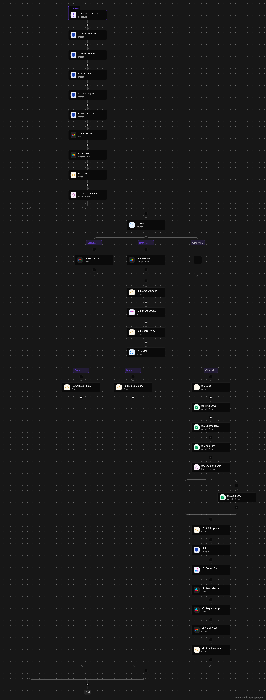

# Sales Call Follow-Up Agent

An automation flow (built on [Activepieces](https://www.activepieces.com/)) that turns a raw sales call transcript into a logged CRM update and an approved, sent follow-up email — with a human-in-the-loop approval step before anything goes out.

## What it does

1. **Watches for new call transcripts** — via Gmail (a transcript-bot sender) or a Google Drive folder
2. **Deduplicates** — fingerprints each call by attendee emails + call date, so the same call is never processed twice
3. **Extracts structured data** — using an AI step to pull call date, attendees, discussion notes, and next steps from the raw transcript, with explicit handling for garbled or internal-only calls
4. **Updates the CRM** — finds or creates the matching row in a Google Sheet, updates deal stage and notes, and logs any action items to a separate tracking tab
5. **Drafts a follow-up email** — AI-generated, referencing the specific concerns and commitments raised on the call (not generic filler)
6. **Requests approval** — sends the draft to Slack and pauses for a real human "approve" before sending anything
7. **Sends the email and logs a run summary** — every path through the flow (successful send, garbled transcript, or skipped/duplicate call) ends in a clear text summary, never a silent no-op

## Architecture

The flow is router-driven at two points:
- **Source router** — branches on whether the incoming item came from Gmail or Drive
- **Outcome router** — branches on whether the call is a duplicate/internal-only, garbled/unreadable, or a valid new call to process

Every branch — including the two "nothing to do" paths — ends on a real text output, so the flow never finishes silently.

### Challenges hit and fixed along the way

- **Diagnosing a silent OAuth scope gap.** Google Drive's "Read File Content" action kept failing with an opaque `[object Response]` error — no useful message, no status code surfaced. File *listing* worked fine, which ruled out a broken connection outright. Traced it down to a scope-level gap in the Drive OAuth app rather than anything in my flow: reconnecting the integration from scratch didn't help, and a direct Drive API call hit the same wall. Rather than ship a flow that silently fails on certain inputs, I kept Gmail as the fully-verified ingestion path and documented Drive as a known platform limitation instead of hiding it.

- **Chasing a bug that wasn't actually a bug.** Mid-flow, a step started throwing `Invalid id value` on a Gmail call. Instinct said "broken reference" — but the real cause was upstream: I'd tested that step in isolation with stale data from an entirely different branch of the flow (a Drive file ID being fed into a Gmail action). The fix wasn't code, it was recognizing that isolated step-testing inside a loop/router structure doesn't reflect real runtime behavior — only a full end-to-end run does.

- **A stale reference that looked correct.** After migrating to a new account for fresh AI credits, several Google Sheets steps kept reading the header row instead of real data — despite every visible field (spreadsheet name, worksheet, column) still showing the right labels. The UI was lying: those dropdowns held onto internal IDs from the old account's connection. Force-reselecting each one (not just visually confirming it looked right) resolved it — a good reminder that "looks correctly configured" and "is correctly wired" aren't the same thing.

- **A bug that only showed up because I varied the test data.** Every test I ran used the same company, so a hardcoded row number and a hardcoded email subject line both passed silently — they only ever needed to be "right" for one specific case. They'd have quietly corrupted data or mislabeled emails for any other input. Caught by deliberately auditing every step's inputs field-by-field rather than trusting "it ran without erroring."

## Known limitations

- **Drive ingestion path** is implemented and correctly routes, but file content download is currently blocked by what diagnostics point to as a scope limitation in the platform's Drive OAuth app, not something fixable from the flow itself.
- **Multiple items in a single run** (e.g. several calls processed in one trigger cycle) was not exhaustively tested — the flow is built to loop over a list, but most testing was done one call at a time.

## Status

Gmail ingestion path fully tested end-to-end, including a real Slack approval round-trip and real email delivery. Core logic (dedup, extraction, routing, CRM sync) verified across multiple test cases.
